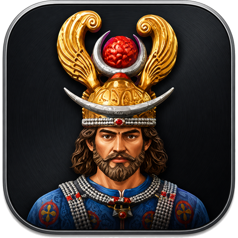
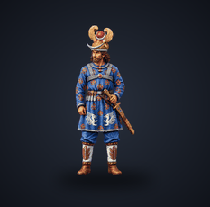
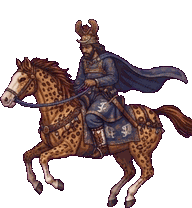
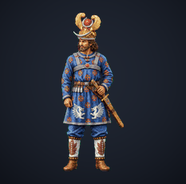
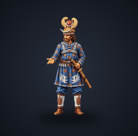
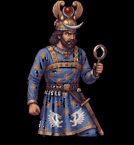
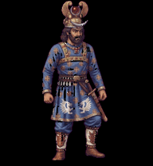
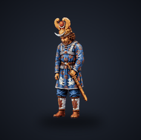
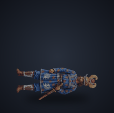

<div align="center">



# Khosrow

**A regal Sasanian warrior‑king who lives on your macOS desktop — and reacts, in real time, to whatever Claude Code is doing.**

Native AppKit · transparent, borderless, always‑on‑top · **no Electron, no web view, no changes to Claude Desktop.**

[](https://github.com/seanmodd/Claude-Khosrow-Pet/actions/workflows/ci.yml) &nbsp;  &nbsp;  &nbsp;  &nbsp; 

</div>

---

Khosrow is a tiny **desktop companion**. He idles, walks, works, cheers, bows, and sleeps — mirroring what Claude Code is doing through a privacy‑preserving hook bridge. He's rendered by a floating, transparent window that stays out of your way (and can be made click‑through so it never gets in it).

<div align="center">




</div>

---

## 🎬 His eleven moods

> Every mood is a real animation — the hand‑drawn scenes (sleeping, reading, writing, success) or a clip from Khosrow's sprite sheet — exactly what you see on your desktop. He switches automatically based on Claude Code activity, or you can pin any one by hand from the menu.

<table>
  <tr>
    <td align="center"><br><b>idle</b><br><sub>resting</sub></td>
    <td align="center"><br><b>attentive</b><br><sub>listening</sub></td>
    <td align="center"><br><b>writing</b><br><sub>composing a reply</sub></td>
    <td align="center"><br><b>reading</b><br><sub>reading a file</sub></td>
    <td align="center"><br><b>searching</b><br><sub>scanning code</sub></td>
    <td align="center"><br><b>editing</b><br><sub>editing files</sub></td>
  </tr>
  <tr>
    <td align="center"><br><b>runningCommand</b><br><sub>running a command</sub></td>
    <td align="center"><br><b>waitingForPermission</b><br><sub>awaiting you</sub></td>
    <td align="center"><br><b>success</b><br><sub>it worked!</sub></td>
    <td align="center"><br><b>failure</b><br><sub>something broke</sub></td>
    <td align="center"><br><b>sleeping</b><br><sub>session over</sub></td>
  </tr>
</table>

### What each state means — and exactly what triggers it

Khosrow has **one** set of eleven states. What *drives* them is a live signal that can come from **either** source you turn on:

- **Hook bridge** — Claude Code fires a hook on each lifecycle event (`PreToolUse`, `Stop`, `SessionEnd`, …); the bridge maps that event to a state. Precise, immediate, and it can see permission prompts and clean finishes.
- **Watch mode** — no install: the pet reads Claude Code's own session transcript and *infers* the state from the newest entry. It sees the same tools, but it can't see a permission prompt or a "turn finished cleanly" signal, so **`waitingForPermission` and `success` are hook‑only** — in Watch mode a clean finish simply settles back to **idle**.

| State | What it means | Fires on — **hook bridge** | Fires on — **Watch mode** |
|-------|---------------|-----------------------------|----------------------------|
| 🧍 **idle** | At rest — nothing is running | `SubagentStop` · a quiet gap | ~25 s of transcript quiet |
| 🙌 **attentive** | Engaged — a session or sub‑task just started | `SessionStart` · `Task`/`Agent` | a session / sub‑task start |
| 📝 **writing** | Composing a response to your prompt | `UserPromptSubmit` · `PostToolUse` (between tools) | you sent a prompt (no reply yet), or Claude is writing prose — **held for the whole turn so he never dozes off mid‑answer** |
| 📖 **reading** | Reading a file | `PreToolUse` · `Read`, `NotebookRead` | those same tools in the transcript |
| 🔎 **searching** | Scanning the codebase or the web | `PreToolUse` · `Grep`, `Glob`, `LS`, `WebFetch`, `WebSearch` · `SubagentStart` | those same tools |
| ✍️ **editing** | Changing files | `PreToolUse` · `Edit`, `Write`, `MultiEdit`, `NotebookEdit`, `Update` | those same tools |
| 🏃 **runningCommand** | Running a shell command | `PreToolUse` · `Bash`, `BashOutput`, `KillShell` | those same tools |
| ✋ **waitingForPermission** | Waiting for **you** to approve something | `PermissionRequest` · `Notification` | *hook‑only — Watch mode can't see permission prompts* |
| 🎉 **success** | A turn / task just finished successfully | `Stop` (ok) | *hook‑only — a clean finish settles to **idle** instead* |
| 🙇 **failure** | A tool or turn just failed | `PostToolUseFailure` · `StopFailure` · any `success:false` | a tool result marked `is_error` |
| 😴 **sleeping** | The session is over — he tucks into bed | `SessionEnd` | ~4 min of transcript quiet |

<sub>You can always **pin** any state by hand from **Mood ▸** (that's *Hold* mode — he ignores Claude Code until you switch back to *Automatic*). A couple of states share art: **attentive** and **waitingForPermission** use the open‑armed *present* clip, and **writing** reuses the hand‑drawn book scene from **reading** until dedicated writing frames are added. The full, tunable event→state map lives in <a href="docs/ANIMATION-MAPPING.md">docs/ANIMATION-MAPPING.md</a>; the hook table is in <a href="docs/CLAUDE-HOOKS.md">docs/CLAUDE-HOOKS.md</a>.</sub>

---

## ✅ What he can do &nbsp;·&nbsp; 🚫 what he can't (yet)

<table>
<tr><th width="50%">✅ &nbsp;Can</th><th width="50%">🚫 &nbsp;Can't (yet)</th></tr>
<tr>
<td valign="top">

- **Float** above every window — transparent & borderless; **drag** him anywhere (**remembers his spot per display**)
- **Click‑through** mode — clicks pass to whatever's beneath
- **Reacts live** to Claude Code across **11 moods** — via hooks **or** hook‑free **Watch mode**
- 🆕 **Watch mode** — follows Claude Code by reading its own session transcripts: **no `settings.json` edit, no restart**
- 🆕 **Show what he's doing** — opt‑in **Detail mode** surfaces the current file / command / prompt
- 🆕 **Skins** — switch characters in‑app from the menu, or drop your own into `~/.claude-pet/skins/` (ships with a **Sepia** variant)
- 🆕 **Mood label** always shown in a pill beneath him; **hover** for a scaling popup explaining *why* — **📌 pin** it to keep it open when you click away or focus elsewhere, **drag** it anywhere, or **✕** to dismiss (same info on **right‑click**, plus controls)
- 🆕 **Notifications** — when Claude finishes or needs you, a bubble pops above him (what happened + timestamp) with an unread **badge**; **↩ Reply** opens *your* session in **Claude Desktop** (via the `claude://resume` deep link) with your message copied — press **⌘V ↵** to send it; **💡 Suggest** drafts the best reply for you (asks `claude` for the ideal next message); or **Open in Claude** jumps to the session. **Drag** it anywhere, **minimize** it, or **✕** it — popups never block each other
- 🆕 **Response timer** — while Claude composes a reply, a small ring near him estimates how far along it is (elapsed seconds + a filling arc), so you can tell a quick answer from a long one at a glance
- **Scale 25% → 400%**, crisp on Retina & multiple monitors; **Show on all Spaces**
- **Menu‑bar control center** (the Faravahar glyph) + an **Animation Test Console**
- Runs **completely standalone**; **100% native AppKit** — no Electron, no web view, never touches Claude Desktop

</td>
<td valign="top">

- Runs on **macOS 12+** only (it's a native app)
- The optional double‑click `.app` is **unsigned** — first launch needs right‑click → **Open**; no notarization, App Store, or sandbox
- **Detail mode is off by default** — turning it on surfaces real content, so mind screen‑shares
- **Watch mode is best‑effort** — it reads Claude Code's transcript format, which can change between releases
- **Replies can't be *silently* injected into a live Claude Desktop session** (there's no local API for that) — instead **Reply** opens the exact session in Claude Desktop via `claude://resume?session=<id>` and puts your message on the clipboard, so it's one **⌘V ↵** away (and you confirm before it sends)
- **💡 Suggest needs the `claude` CLI signed in** — it shells out to `claude -p`; if the CLI is signed out (expired token), run `claude` once in Terminal to re-authenticate. (Reply doesn't need the CLI — it uses the deep link.)
- No sound; doesn't auto‑launch at login (add it yourself if you'd like)

</td>
</tr>
</table>

---

## 🎛️ The Faravahar menu


Every control lives behind the **Faravahar** glyph in your menu bar:

- **Pause / Resume** — freeze or resume the animation
- **Sleep / Wake** — curl up & dim, or return to idle
- **State ▸** — *Follow Claude Code*, or pin any of the 11 moods by hand
- **Watch Claude Code (live)** — follow his transcripts with **no install, no restart**
- **Show detail** — opt‑in: surface the current file / command / prompt
- **Click‑through** — let the mouse pass beneath him
- **Float on top** · **Show on all Spaces** — window‑behavior toggles
- **Scale ▸** — 25% … 400% (the pet sprite)
- 🆕 **Text size ▸** — 75% … 300% for the mood pill, popups, notifications, badge & timer ring — **independent of Scale**, so you can keep the pet small but the text big
- **Skin ▸** — switch characters (Khosrow, Sepia, or your own from `~/.claude-pet/skins/`)
- **Animation Test Console…** — preview every clip, step frames, check the alpha cut‑out
- **Reset Position** — bring him home (a lifesaver on a multi‑display setup)
- **Quit Khosrow**

---

## 🚀 Quick start

```bash
git clone https://github.com/seanmodd/Claude-Khosrow-Pet.git
cd Claude-Khosrow-Pet/app
swift run KhosrowApp        # the Faravahar appears in the menu bar; Khosrow near the lower-right
```

**Make him react to Claude Code** — two ways:

- **No install (recommended):** menu → **Watch Claude Code (live)**. He follows Claude Code's session transcripts — no `settings.json`, no restart. (Or run it yourself: `python3 bridge/watch_claude.py` — add `--detail` for the *what*.)
- **Hook bridge:**
  ```bash
  cd ../bridge
  ./install_hooks.sh --dry-run   # preview the exact settings merge — writes nothing
  ./install_hooks.sh             # timestamped backup + merge; then restart Claude Code
  ```

**See every mood without Claude Code:**

```bash
python3 bridge/simulate_states.py --cycle              # visit all 11 moods
python3 bridge/simulate_events.py --scenario session   # a scripted work session
```

Full walkthrough → **[INSTALL.md](INSTALL.md)** · on‑Mac visual checklist → **[docs/LOCAL-MAC-VERIFICATION.md](docs/LOCAL-MAC-VERIFICATION.md)**

---

## 🔒 Privacy, in one line

The bridge only ever writes this — and nothing else:

```json
{ "state": "editing", "toolCategory": "file-edit", "timestamp": "2026-07-18T03:54:27Z", "success": true }
```

No prompts, code, file paths, commands, or command output ever leave your machine. An adversarial redaction test stuffs a payload full of passwords, API keys, and SSH paths and proves none of it leaks. **Detail mode is opt‑in** (off by default): enable it and the payload gains a short `detail` string — a file name, command, or prompt snippet — so the pet can show *what* you're doing. That's your call. Details → **[PRIVACY.md](PRIVACY.md)** · **[docs/CLAUDE-HOOKS.md](docs/CLAUDE-HOOKS.md)**

---

## 🧩 Under the hood

| Layer | What it is |
|-------|------------|
| **UI** | Swift + AppKit — one borderless, transparent, floating window |
| **Core** | `KhosrowKit` — pure, cross‑platform logic (manifest, frame math, state map), unit‑tested |
| **Bridge** | stdlib‑only Python — hooks **or** a transcript watcher (`watch_claude.py`) → a minimal state file |
| **Art** | 1536×2288 sheet · 8×11 grid · **11 clips / 74 frames** |

```
app/       Swift package — KhosrowKit (logic) + KhosrowApp (AppKit UI) + tests
bridge/    Claude Code hook bridge, event/state simulators, safe installer
scripts/   deterministic asset tooling (Pillow)
docs/      inventory, schema, animation map, hooks, verification, media
```

Deeper reading → [ARCHITECTURE.md](ARCHITECTURE.md) · [TROUBLESHOOTING.md](TROUBLESHOOTING.md) · [HANDOFF.md](HANDOFF.md)

---

## Attribution

The character art (`spritesheet.webp`), `pet.json`, and the app icon are the owner's own custom pet assets. The menu‑bar glyph is the **Faravahar**, an ancient Zoroastrian symbol. The application, bridge, and tooling in this repository are provided for use with those assets.

<div align="center"><sub><br>Built for macOS with Swift &amp; AppKit — and driven, fittingly, by Claude Code.</sub></div>
